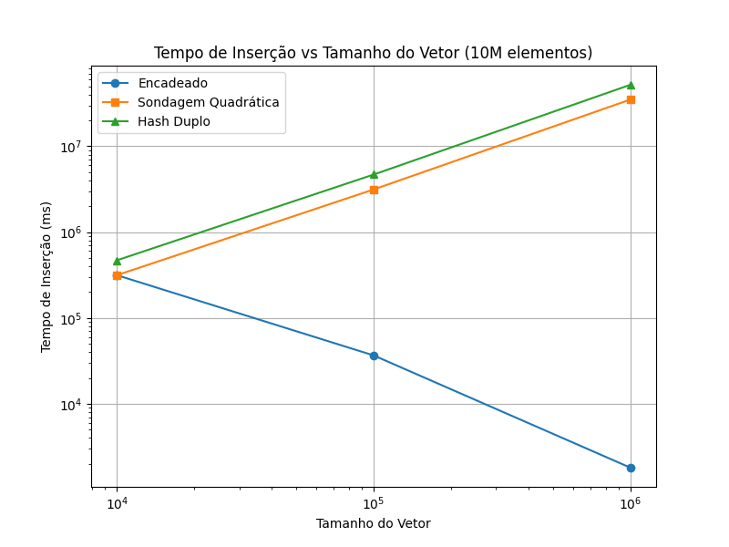
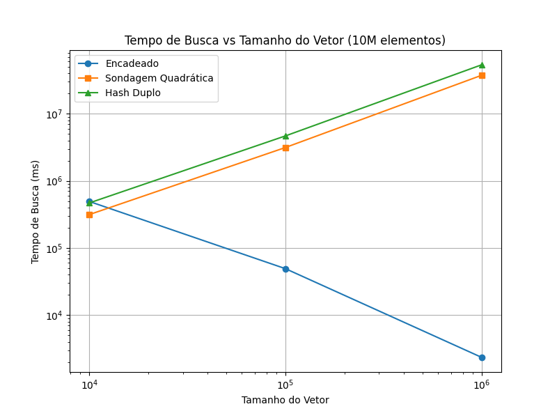
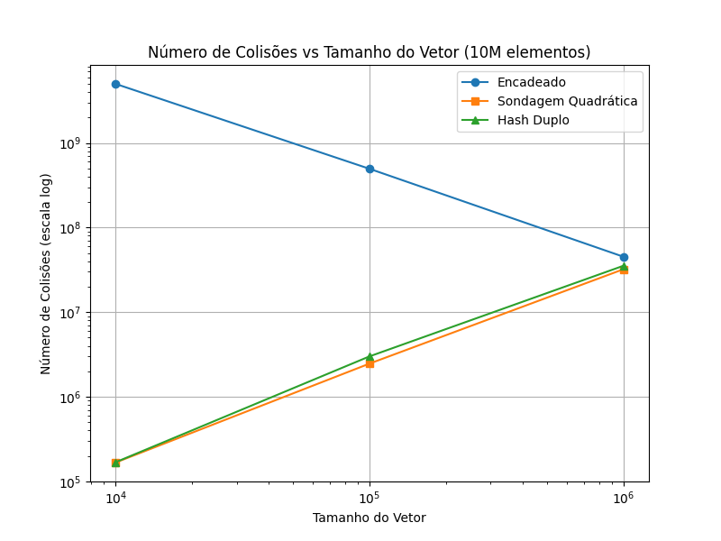
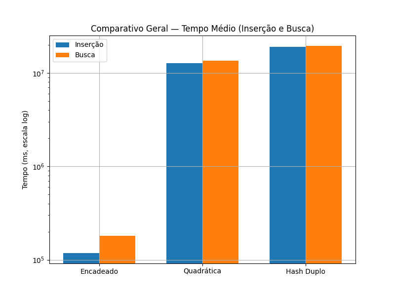

# PJBL - HASH: Análise de Desempenho de Tabelas Hash em Java

## Identificação
- Disciplina: Resolução de Problemas Estruturados em Computação
- Turma: B - manhã
- Curso: Ciência da Computação
- Universidade: Pontifícia Universidade Católica do Paraná (PUCPR) 
- Professor: Andrey Cabral Meira
- Aluna: Natália Moritani Trevisol


## 1. Introdução
Este trabalho tem como objetivo comparar o desempenho de três implementações de tabelas hash em Java:
- Encadeamento separado (vetores de listas)
- Rehashing com Hash Duplo
- Rehashing com Sondagem Quadrática

Foram utilizados três tamanhos diferentes de vetores (10.000, 100.000 e 1.000.000) e três conjuntos de dados (100.000, 1.000.000 e 10.000.000 registros).

Os testes foram realizados em um notebook com processador Intel Core i3, 8 GB de RAM, utilizando a JVM padrão do Java 17.

---

## 2. Configurações e Metodologia
| Parâmetro | Valor |
|------------|--------|
| Linguagem | Java 17 |
| IDE | IntelliJ IDEA 2025.1.2 |
| Conjuntos de dados | 100.000, 1.000.000, 10.000.000 registros |
| Tamanhos dos vetores | 10.000, 100.000, 1.000.000 |
| Seed aleatória | `12345` (fixa para garantir comparabilidade) |
| Tempo medido em | milissegundos |
| Métricas analisadas | Tempo de inserção, tempo de busca, número de colisões, 3 maiores listas encadeadas geradas, gaps entre elementos no vetor |

### 2.1 Funções de Hash Utilizadas
Para garantir a reprodutibilidade dos resultados, as funções de hash foram definidas conforme a técnica implementada:

- **Encadeamento separado:**  
  `hash = key % tamanhoVetor`

- **Hash Duplo:**  
  `hash1 = key % tamanhoVetor`  
  `hash2 = 7 - (key % 7)`  
  A posição final é calculada como:  
  `(hash1 + i * hash2) % tamanhoVetor`, onde *i* é o número de tentativas.

- **Sondagem Quadrática:**  
  `hash = (key + i²) % tamanhoVetor`, onde *i* é incrementado a cada colisão.

Essas funções foram escolhidas por sua simplicidade e eficiência para chaves numéricas sequenciais.

---

## 3. Como rodar o projeto

### Requisitos
- Java 17+  
- IDE como IntelliJ IDEA ou Eclipse (opcional)  
- Memória suficiente para grandes volumes de dados (1M ou 10M registros)  
- Python (opcional) ou qualquer ferramenta de planilha para gerar gráficos

### Estrutura do projeto 
src/
  └─ jav/

     ├─ clean/       # código sem comentários detalhados
     
     └─ commented/   # código com comentários explicativos


### Passos para executar

1. **Compilar o código Java**
  No terminal, dentro da pasta raiz do projeto:
  
  Para a versão clean:
  ```bash
  javac -d out src/jav/clean/*.java
  ```

  Para a versão commented:
  ``` bash
  javac -d out src/jav/commented/*.java
  ```
  
  Isso cria a pasta out/ com os arquivos .class organizados pelos pacotes (jav.clean ou jav.commented).

2. **Executar os experimentos**
  Para clean:
  ```bash
  java -cp out jav.clean.Experimentos
  ```

  Para commented:
  ```bash
  java -cp out jav.commented.Experimentos
  ```

  Para rodar com grandes volumes de dados (1M ou 10M registros), aumente a memória disponível se necessário:
  ```bash
  java -Xmx8g -cp out jav.clean.Experimentos
  ```
  O programa irá gerar no terminal:
  - Tempo de inserção e busca (em ms)
  - Número de colisões
  - Top 3 buckets (para encadeamento)
  - Estatísticas de gaps

  Exemplo de saída esperada:
  ```bash
  === Encadeado: vetor=10000 itens=100000
  Insert(ms): 12  Search(ms): 8  Collisions: 452344
  Top3 buckets: 12, 12, 12
  Gaps: nenhum gap (ou tabela vazia)
  ```

3. Gerar gráficos

  - Copie os resultados do terminal.
  
  - Abra o script Python graficos.py.

  - Atualize as variáveis do script com os valores medidos nos testes (tempo de inserção, busca, colisões).

  Execute o script:
  ```bash
  python graficos.py
  ```

  Os gráficos serão gerados na tela e podem ser salvos manualmente em results/graficos/.
  
4. **Dicas e recomendações**
  
  Para conjuntos muito grandes, ajuste a memória com -Xmx (ex.: -Xmx8g)
  
  A seed utilizada garante reprodutibilidade dos dados
  
  Para análises rápidas, você pode reduzir os tamanhos dos vetores e dados no main() de Experimentos.java

---

## 4. Resultados

### 4.1. Conjunto de 100.000 elementos

| Implementação | Tamanho do Vetor | Tempo de Inserção (ms) | Tempo de Busca (ms) | Colisões | Top 3 Buckets | Gaps                         |
| ------------- | ---------------- | ---------------------- | ------------------- | -------- | ------------- | ---------------------------- |
| Encadeado     | 10.000           | 10                     | 7                   | 452.344  | 12, 12, 12    | nenhum gap                   |
| Hash Duplo    | 10.000           | 4.850                  | 4.943               | 138.122  | —             | nenhum gap                   |
| Quadrática    | 10.000           | 3.027                  | 3.327               | 147.716  | —             | nenhum gap                   |
| Encadeado     | 100.000          | 4                      | 3                   | 11.996   | 2, 2, 2       | min: 1 — max: 1 — avg: 1,00  |
| Hash Duplo    | 100.000          | 0                      | 0                   | 0        | —             | nenhum gap                   |
| Quadrática    | 100.000          | 5                      | 1                   | 0        | —             | nenhum gap                   |
| Encadeado     | 1.000.000        | 9                      | 4                   | 0        | 1, 1, 1       | min: 4 — max: 15 — avg: 9,00 |
| Hash Duplo    | 1.000.000        | 2                      | 8                   | 0        | —             | nenhum gap                   |
| Quadrática    | 1.000.000        | 0                      | 0                   | 0        | —             | nenhum gap                   |

---

### 4.2. Conjunto de 1.000.000 elementos

| Implementação | Tamanho do Vetor | Tempo de Inserção (ms) | Tempo de Busca (ms) | Colisões   | Top 3 Buckets | Gaps                        |
| ------------- | ---------------- | ---------------------- | ------------------- | ---------- | ------------- | --------------------------- |
| Encadeado     | 10.000           | 554                    | 1.808               | 49.502.258 | 103, 102, 102 | nenhum gap                  |
| Hash Duplo    | 10.000           | 45.882                 | 45.488              | 148.636    | —             | nenhum gap                  |
| Quadrática    | 10.000           | 30.847                 | 29.488              | 181.826    | —             | nenhum gap                  |
| Encadeado     | 100.000          | 46                     | 63                  | 4.523.139  | 11, 11, 11    | nenhum gap                  |
| Hash Duplo    | 100.000          | 418.905                | 424.040             | 2.949.568  | —             | nenhum gap                  |
| Quadrática    | 100.000          | 285.927                | 277.233             | 2.682.118  | —             | nenhum gap                  |
| Encadeado     | 1.000.000        | 14                     | 17                  | 141.004    | 2, 2, 2       | min: 1 — max: 1 — avg: 1,00 |
| Hash Duplo    | 1.000.000        | 6                      | 5                   | 0          | —             | nenhum gap                  |
| Quadrática    | 1.000.000        | 5                      | 5                   | 0          | —             | nenhum gap                  |

---

### 4.3. Conjunto de 10.000.000 elementos

| Implementação | Tamanho do Vetor | Tempo de Inserção (ms) | Tempo de Busca (ms) | Colisões      | Top 3 Buckets    | Gaps       |
| ------------- | ---------------- | ---------------------- | ------------------- | ------------- | ---------------- | ---------- |
| Encadeado     | 10.000           | 315.355                | 492.961             | 4.995.004.158 | 1002, 1002, 1002 | nenhum gap |
| Hash Duplo    | 10.000           | 469.320                | 467.953             | 168.488       | —                | nenhum gap |
| Quadrática    | 10.000           | 314.640                | 313.975             | 167.132       | —                | nenhum gap |
| Encadeado     | 100.000          | 36.631                 | 49.143              | 495.030.359   | 102, 102, 102    | nenhum gap |
| Hash Duplo    | 100.000          | 4.682.697              | 4.668.312           | 3.005.398     | —                | nenhum gap |
| Quadrática    | 100.000          | 3.138.931              | 3.136.340           | 2.468.808     | —                | nenhum gap |
| Encadeado     | 1.000.000        | 1.802                  | 2.345               | 45.197.162    | 12, 12, 12       | nenhum gap |
| Hash Duplo    | 1.000.000        | 52.046.508             | 53.477.912          | 35.393.534    | —                | nenhum gap |
| Quadrática    | 1.000.000        | 35.053.603             | 37.342.884          | 32.209.101    | —                | nenhum gap |

---

## 5. Resultados Gráficos

### 5.1 Tempo de Inserção vs Tamanho do Vetor


### 5.2 Tempo de Busca vs Tamanho do Vetor


### 5.3 Número de Colisões (Escala Logarítmica)


### 5.4 Comparativo Geral das Técnicas


---

## 6. Análise dos Resultados

### 6.1 Encadeamento
- Excelente desempenho quando o tamanho da tabela é grande em relação ao número de elementos (ex.: vetor = 1.000.000, dados = 10.000.000).  
- Sofre com **altas colisões** quando o vetor é pequeno, gerando listas encadeadas longas.

### 6.2 Hash Duplo
- **Evita clusters** (aglomerados) melhor que sondagem linear, mas é sensível ao fator de carga.  
- Para vetores grandes, o desempenho degrada com o aumento de colisões (principalmente em 10 milhões).

### 6.3 Sondagem Quadrática
- Geralmente mais rápida que hash duplo, mas também sofre se o vetor não for proporcionalmente grande.  
- Apresentou **menos colisões e tempos menores** que o hash duplo na maioria dos casos.

### 6.4 Comparativo Geral

- **Para 100.000 elementos:** todas as abordagens tiveram tempos baixos, mostrando boa eficiência geral.  
- **Para 1.000.000 elementos:** o encadeamento manteve bom desempenho; sondagem quadrática começou a se destacar.  
- **Para 10.000.000 elementos:** o hash duplo foi o mais lento, enquanto o encadeamento teve muitas colisões, mas ainda operou de forma estável; sondagem quadrática teve o melhor equilíbrio entre tempo e colisões.

A análise mostra que o desempenho depende fortemente do **fator de carga (load factor)**.  
Quando `n` (elementos) se aproxima do tamanho do vetor, a probabilidade de colisões cresce exponencialmente.

---

## 7. Conclusões
A análise comparativa das três implementações mostra que o desempenho das tabelas hash está fortemente relacionado ao fator de carga e à estratégia de resolução de colisões escolhida. Com base nos experimentos realizados com diferentes volumes de dados e tamanhos de vetores, observou-se que:

- **Encadeamento separado** apresentou o comportamento mais estável e previsível, mantendo tempos baixos de inserção e busca mesmo com grandes volumes de dados.
No entanto, sofre com alto número de colisões e consumo de memória adicional, uma vez que cada colisão cria um novo nó na lista encadeada.
Essa técnica foi a mais adequada quando o tamanho do vetor foi significativamente menor que o número de elementos (vetor pequeno e fator de carga alto).

- **Sondagem quadrática** foi a melhor em termos de desempenho global, apresentando o melhor equilíbrio entre tempo de inserção, tempo de busca e número de colisões.
Ela manteve desempenho consistente mesmo para 10 milhões de registros, sendo mais rápida que o hash duplo e mais eficiente em uso de memória que o encadeamento.
Essa técnica se mostrou ideal quando o vetor tem tamanho proporcional ao número de elementos (fator de carga ≤ 0,7).

- **Hash duplo** foi o método mais custoso computacionalmente, com tempos de execução muito altos para grandes volumes de dados.
Apesar de teoricamente reduzir clusters, na prática sua performance depende fortemente da escolha da segunda função de hash e do fator de carga, o que o torna mais sensível e menos previsível.

- **Conclusão geral:**
A Sondagem Quadrática foi a técnica com melhor desempenho geral, equilibrando tempo de execução e número de colisões.
O Encadeamento Separado é mais robusto e escalável para casos de alta carga (muitos elementos), mas com custo de memória maior.
O Hash Duplo, embora interessante teoricamente, apresentou os piores tempos práticos neste conjunto de experimentos.

Para aplicações reais, recomenda-se manter o fator de carga menor ou igual a 0,7 e considerar técnicas híbridas, como encadeamento com redimensionamento dinâmico, que unem desempenho estável e uso eficiente de memória.
